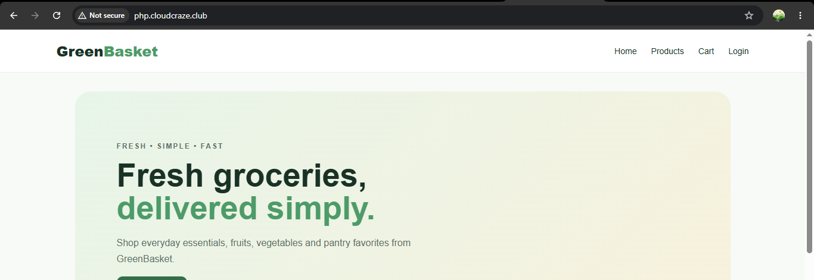

# GreenBasket – PHP Grocery Store

A simple full-stack grocery shopping website built with **PHP, MySQL, HTML, CSS and JavaScript**.

## Features

- Responsive grocery storefront
- Product categories and product listing
- Shopping cart
- User registration and login
- Checkout and order storage
- Simple admin dashboard
- MySQL database

## Frontend

- HTML5
- CSS3
- JavaScript

## Backend

- PHP
- MySQL / MariaDB

## Prerequisites

- AWS EC2 – Amazon Linux 2023
- Nginx
- PHP
- MySQL / MariaDB
- Git
- GitHub
- Domain / Subdomain

## AWS Deployment

### 1. Launch EC2 Instance

Launch an **Amazon Linux 2023 EC2 instance**.

Configure the Security Group with:

- SSH – `22`
- HTTP – `80`
- HTTPS – `443`

Use the **EC2 Public IP** for the deployment.

### 2. Update System

```bash
sudo yum update -y
```

### 3. Install Nginx, PHP and Git

```bash
sudo yum install nginx php php-mysqli php-fpm git -y
```

Start and enable Nginx:

```bash
sudo systemctl start nginx
sudo systemctl enable nginx
```

Start and enable PHP-FPM:

```bash
sudo systemctl start php-fpm
sudo systemctl enable php-fpm
```

Check the services:

```bash
sudo systemctl status nginx
sudo systemctl status php-fpm
```

### 4. Clone the Project

Move to the Nginx web directory:

```bash
cd /usr/share/nginx/html
```

Clone the GitHub repository:

```bash
sudo git clone YOUR_GITHUB_REPOSITORY_URL greenbasket
```

Set permissions:

```bash
sudo chown -R nginx:nginx greenbasket
```

### 5. Configure Nginx

Create the PHP Nginx configuration file:

```bash
sudo nano /etc/nginx/conf.d/php.conf
```

Add:

```nginx
server {
    listen 80;
    server_name php.cloudcraze.club;

    root /usr/share/nginx/html/greenbasket;
    index index.php index.html;

    location / {
        try_files $uri $uri/ /index.php?$query_string;
    }

    location ~ \.php$ {
        include fastcgi_params;
        fastcgi_param SCRIPT_FILENAME $document_root$fastcgi_script_name;
        fastcgi_pass unix:/run/php-fpm/www.sock;
    }
}
```

Save the file and test the Nginx configuration:

```bash
sudo nginx -t
```

Restart Nginx:

```bash
sudo systemctl restart nginx
```

### 6. Install MariaDB

Install MariaDB:

```bash
sudo yum install mariadb105-server -y
```

Start and enable MariaDB:

```bash
sudo systemctl start mariadb
sudo systemctl enable mariadb
```

Check the service:

```bash
sudo systemctl status mariadb
```

### 7. Configure Database

Login to MariaDB:

```bash
mysql -u root -p
```

Create the database:

```sql
CREATE DATABASE greenbasket;
```

Exit:

```sql
exit;
```

Import the project database:

```bash
mysql -u root -p greenbasket < /usr/share/nginx/html/greenbasket/database/greenbasket.sql
```

### 8. Configure PHP Database Connection

Edit:

```bash
sudo nano /usr/share/nginx/html/greenbasket/config/database.php
```

Update the database credentials:

```php
$host = "localhost";
$user = "root";
$password = "YOUR_PASSWORD";
$database = "greenbasket";
```

Save the file.

Restart PHP-FPM and Nginx:

```bash
sudo systemctl restart php-fpm
sudo systemctl restart nginx
```

### 9. Configure Domain

In your domain DNS settings, create an **A Record**:

```text
php.cloudcraze.club  →  EC2 Public IP
```

After DNS propagation, open:

```text
http://php.cloudcraze.club
```

The GreenBasket PHP website should now be accessible.

> **Note:** This project uses the EC2 Public IP. No Elastic IP is used.

## Project Structure

```text
greenbasket/
│
├── index.php
├── products.php
├── cart.php
├── checkout.php
├── login.php
├── register.php
├── logout.php
│
├── admin/
│   └── index.php
│
├── config/
│   └── database.php
│
├── includes/
│   ├── header.php
│   └── footer.php
│
├── assets/
│   ├── css/
│   │   └── style.css
│   ├── js/
│   │   └── script.js
│   └── images/
│
├── database/
│   └── greenbasket.sql
│
└── README.md
```

## Future Improvements

- Online payment gateway
- Product image upload
- Complete admin product management
- Order status tracking
- HTTPS with SSL
- User profile management

# Output

